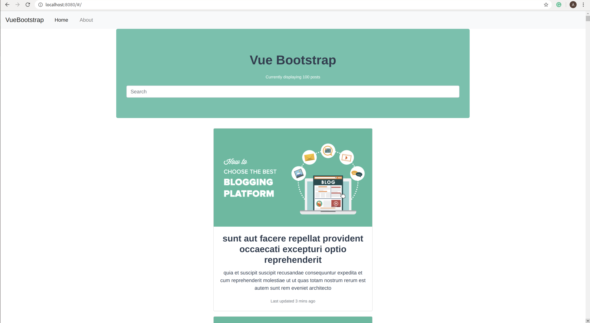

# Demo VueJs Blog Application

Simple VueJs front-end application to illustrate basics concepts:

1. Components & components nesting
2. http requests - Vue Router via  https://jsonplaceholder.typicode.com/
3. routing - Vue Router


<p align="center">
  
  
</p>

## Running the application

``` bash
# install dependencies
npm install

# serve with hot reload at localhost:8080
npm run dev

# build for production with minification
npm run build
```

For detailed explanation on how things work, consult the [docs for vue-loader](http://vuejs.github.io/vue-loader).


## TODO

Future improvements would include:

1. adding authentication
2. CRUD operations
3. better state management


## Acknowledgments

Hat tip to anyone whose code was used.
The image (https://cdn2.wpbeginner.com/wp-content/uploads/2019/01/choosethebestbloggingplatform.png) is strictly for educational purposes. 


``` bash
The GNU General Public License (GNU GPL or GPL) is a series of widely used free software licenses that guarantee end users the freedom to run, study, share, and modify the software

```


